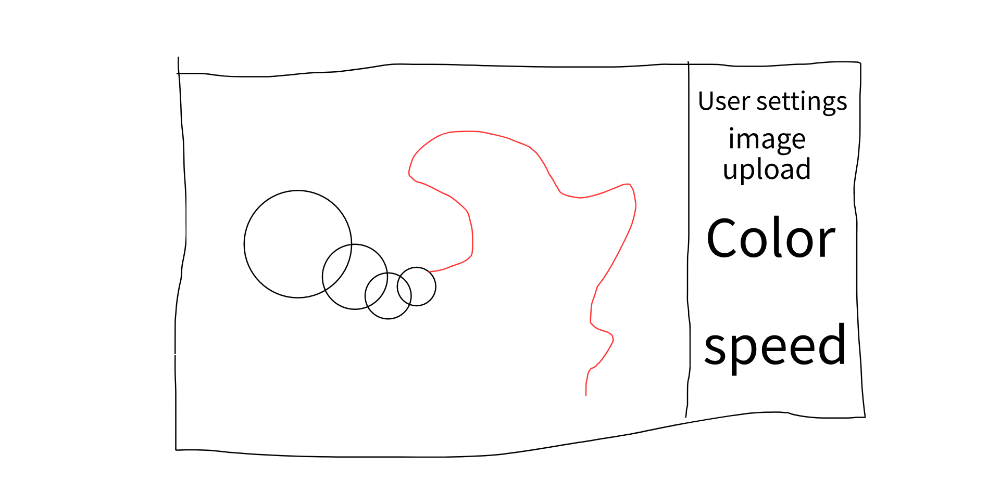
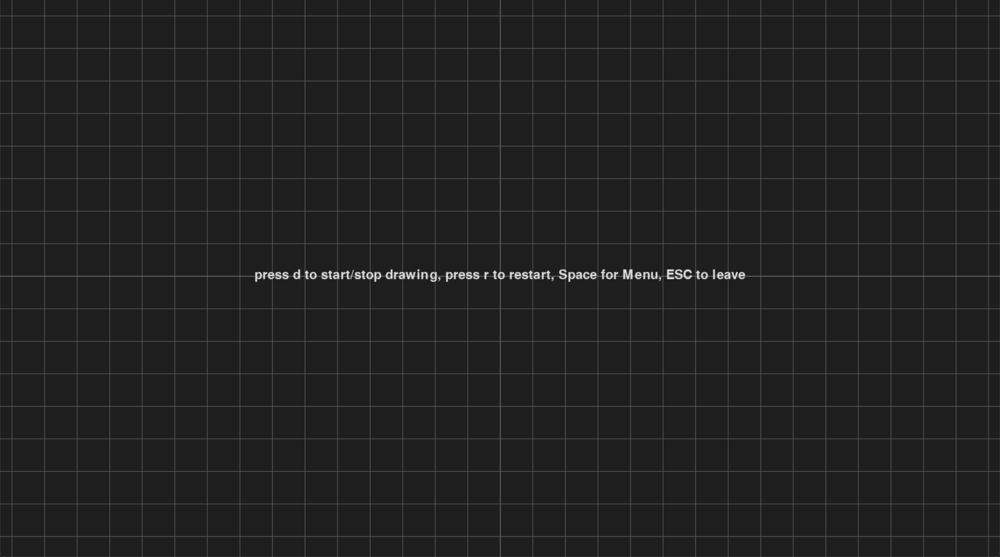
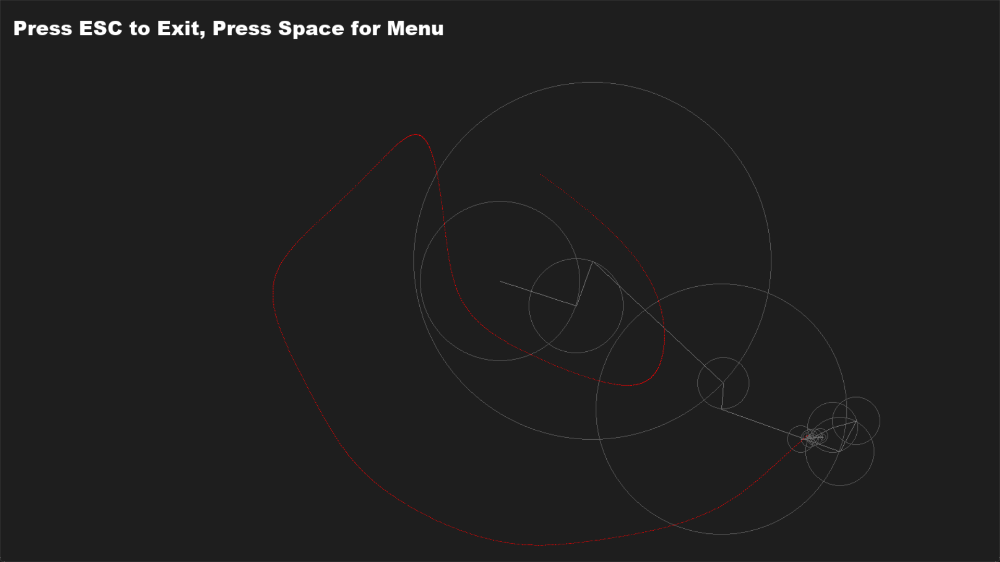
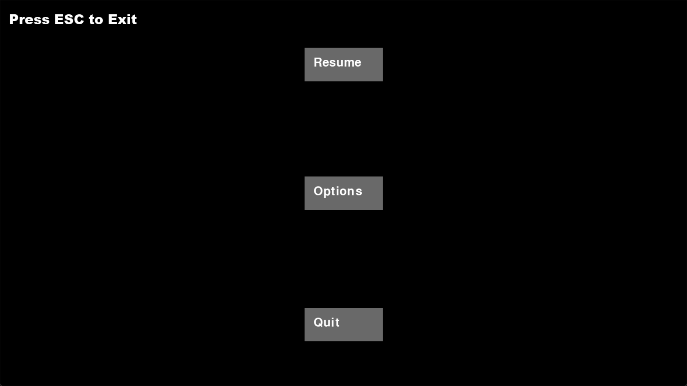
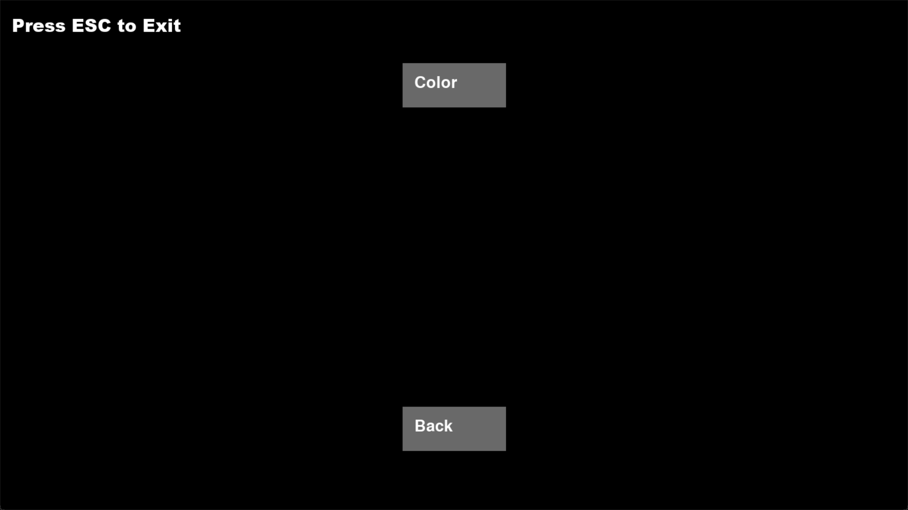
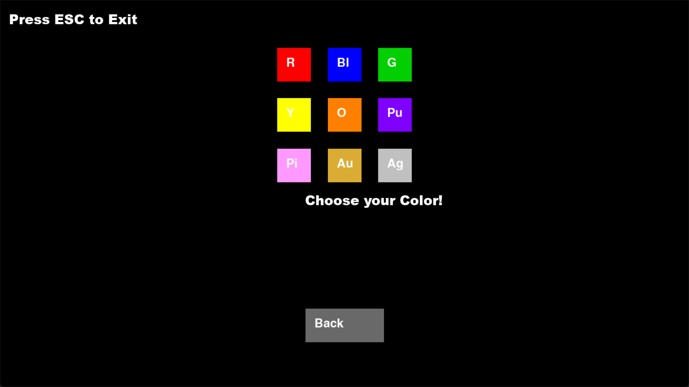

:warning: Everything between << >> needs to be replaced (remove << >> after replacing)

# Drawing with Fourier Transformations
## CS110 Final Project Fall Semester, 2023

## Team Members

Benjamin Panamdanam
Hiten Malhotra

***

## Project Description

The program will allow the user to trace a figure on a drawing platform. The program will then recreate that figure using Fourier Transformations. Color of the drawing can be chosen as well.  (NOTE: I added everything that was on the template of the readme given, but there are some things that were on the rubric but not on the template provided. I will give a quick run down of them
Additional Modules: none that I can think of/
Class Relationship Diagram: the buttons work within the controller so that they move the menus around and can highlight when hovered over. The changed button changes the variable in the controller which makes the viewer see something different.
Data Permeance: coordinates are saved into separate file
File Structre: As requested/ After running there might be an error but that does not stop anything.)

***    

## GUI Design

### Initial Design

### Final Design

## Program Design

### Features
1. User Drawing 
2. Color Selector
3. Separate Menus
4. Epigraphs Visible 
5. Saving Coordinate to separate file

### Classes

- class Button: This class is what encapsulates all buttons used within the program. Its initialization selects the text, color and makes the button a rect object. The highlight method is what makes the button lighten in color when hovered over, and the color_default sets the normal color of the button

- class Controller: This class is what allows the code to run within the main.py. The initialization is what sets the screen, the multiple buttons and the gamestate. The draw_text method creates a way to put text on screen. The mainloop program checks what the state of the program is set to, which then decides what loop to use. the menuloop sets the program to the main pause menu accessed through the space bar, the options loop brings the game to the where the user can select if they want to change the color or not. The color loop allows for the selection of the drawings color. the game loop contains the actual creation the of drawing. Each method contains a way to change the state to access a different menu. 

## ATP

1. Action: Click the d button on the keyboard and move the Mouse and draw across the screen and then press d again. Result: A group of epigraphs should appear and draw out the shape drawn
2. Action: Click Space button. Result: the applications should go from the gameloop to the menuloop with different options
3. Action: Move the mouse around and click on the different buttons. Result: The application should change between different menu screens
4. Action: Using the mouse, from the main menu click the options button, and then click the color button, and then select a new color before returning to the main gameloop, and then draw an image. Result: The drawing should be using the color that was selected
5. Action: Click the d keyboard button and move the Mouse and draw across the screen and then press d again. While the shape is being drawn, press the R button on the keyboard. Result: the drawing should stop and the user should be brought back to the screen before, allowing the user to draw another shape. ()

